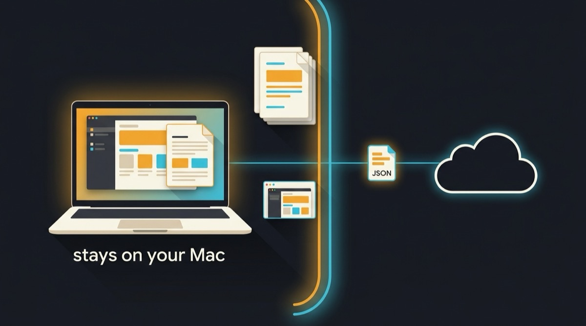

# macos-vision-mcp

<p align="center">
  
</p>

Local, private, offline OCR **and UI testing** for any MCP client — no API keys, no uploads.
Cut document token costs by ~97%, and let an agent see and click your Mac's UI without a single screenshot leaving the machine.

[](https://www.npmjs.com/package/macos-vision-mcp)
[](https://www.npmjs.com/package/macos-vision-mcp)
[](https://github.com/woladi/macos-vision-mcp/stargazers)
[](LICENSE)
[](https://developer.apple.com/documentation/vision)
[](#privacy-layer)
[](#what-you-get)
[](https://glama.ai/mcp/servers/woladi/macos-vision-mcp)

Pre-extracts text and image data locally before your AI ever sees it — cutting token usage by ~97% on real documents and returning structured paragraphs, lines, and bounding boxes so the model can reconstruct the document into Markdown, HTML, DOCX, or any other format. Files never leave your Mac: no cloud API, no API keys, no network requests.

> <sub>**How the ~97% is measured:** a 44-page scanned PDF sent as page images costs ~73,500 tokens; the same file run through `analyze_document` returns ~2,400 tokens of extracted text and structure (raw page-image tokens vs. extracted-text tokens). Your numbers vary with page density and tokenizer — treat 97% as the order of magnitude, not a guarantee.</sub>

**Contents:** [Quick Start](#quick-start) · [What you get](#what-you-get) · [UI testing](#ui-testing-without-sending-screenshots-anywhere) · [Why it's different](#why-its-different) · [Available Tools](#available-tools) · [Usage](#usage) · [Example workflows](#example-workflows) · [Configuration](#configuration) · [Privacy layer](#privacy-layer)

## What you get

- OCR for images and PDFs (JPG, PNG, HEIC, TIFF, multi-page PDF) via Apple Vision Framework.
- ~97% token reduction: a 44-page PDF costs ~2,400 tokens instead of ~73,500.
- Reading-order paragraphs + raw text blocks with bounding boxes — rich structure for the model to reconstruct the document into any output format (Markdown, HTML, DOCX, JSON), not a lossy plain-text dump.
- Face detection, barcode/QR reading, and image classification — all on-device.
- Full document pipeline: OCR + faces + barcodes + rectangles in a single tool call.
- Works with Claude Code, Claude Desktop, and Cursor — any MCP-compatible client.
- No files uploaded to any server — processing stays entirely on your Mac.
- **UI testing for agents**: screenshot a window locally, find an element by its visible text, get back click coordinates, and assert what's on screen — all without uploading the screenshot.
- 100% offline after `npm install` — powered by Apple Vision Framework, same engine as Live Text in Photos.app.

## ❌ Without / ✅ With

❌ **Without macos-vision-mcp:**

- Sending a 44-page PDF costs ~73,500 tokens
- Every image, invoice, or contract goes through a cloud API
- Sensitive documents leave your machine on every request

✅ **With macos-vision-mcp:**

- Local Apple Vision pre-extracts text before Claude ever sees it
- ~2,400 tokens for the same 44-page PDF — 97% fewer
- Files never leave your Mac

## UI testing without sending screenshots anywhere

The usual way to let an agent work with a GUI is to screenshot the screen and upload it to a
vision model. That is one network round trip, one image-token bill, and one copy of whatever was
on screen — per step. A ten-step flow means ten uploads of your desktop.

This server does the seeing locally. Apple's Vision framework runs on the Neural Engine, so the
screenshot stays on disk and only text, geometry, and verdicts reach the model.

```
find_element(query: "Save", app: "MyApp")
  → { found: true, matches: [{ text: "Save", method: "exact",
        clickPoint: { x: 812, y: 556 }, bbox: {...} }] }

# hand clickPoint to any input driver — macos-mcp, cliclick, CGEvent
# then verify, again locally:

assert_text(expect: "Saved", app: "MyApp")  → { pass: true, ... }
```

`clickPoint` is in global screen points with a top-left origin — the same space click drivers
use, so it goes straight to a driver with no conversion. This server deliberately does not click:
it is eyes, not hands, and therefore never asks for control of your machine.

### Is it actually cheaper, safer, and faster?

Measured on an **Apple M1 Pro (2021, 16 GB)** against a 2992×1734 Retina window capture of a
real, text-dense app — median of five runs each.

|                          | Local (this server)                                 | Screenshot → cloud vision API        |
| ------------------------ | --------------------------------------------------- | ------------------------------------ |
| **Tokens per step**      | ~240 (an `assert_text` verdict)                     | ~6,900 (image tokens for 2992×1734)  |
| **Data leaving the Mac** | none                                                | ~750 KB PNG of your screen, per step |
| **Network**              | none — works offline, on a plane, behind an air gap | one round trip per step              |
| **Latency**              | 1.17–1.25 s end-to-end for `find_element`           | upload + inference + return          |
| **Cost**                 | $0                                                  | per-image, per-step, forever         |

> <sub>Image tokens are estimated with Anthropic's `width × height / 750` rule; other providers
> tile differently, so the exact figure moves but the order of magnitude does not. Local token
> counts are the actual JSON payloads the tools returned, at ~4 characters per token.</sub>

**Cheaper: yes, and the ratio is large.** A pass/fail verdict is ~240 tokens against ~6,900 for
the image it replaces — roughly **29× less** for the same answer. Over a 20-step UI test that is
~4,800 tokens instead of ~138,000.

**Safer: yes, and this is the part that does not show up on an invoice.** A screenshot is not a
neat crop of the widget under test. It carries whatever else was on screen: other windows, a
password manager, a customer's data, an open inbox. Sending one to a third party is a disclosure
you cannot take back, and it repeats on every step. Here the PNG is written to a temp file, read
by an on-device model, and never serialised into the conversation — the tools return paths,
geometry, and text, never image bytes. That invariant lives in the code, not just in this README.

**Faster: usually, and always more predictable.** The honest breakdown of the 1.17–1.25 s:
capture 0.31–0.41 s, Vision OCR of the full window ~1.04 s, matching <1 ms. There is no network
term at all. The cloud path has to upload ~750 KB before inference even starts — on a 50 Mbit/s
uplink that alone is ~0.12 s, on a 10 Mbit/s hotel connection ~0.6 s — then wait for a vision
model and the response to come back. We have not benchmarked any specific provider, so treat the
right-hand column as structure rather than a measured number; what we can state is that the local
path has no variance from bandwidth, rate limits, or provider load, and it does not fail when the
Wi-Fi does.

Two honest caveats. Targeting a single region instead of a whole window cuts the OCR term
sharply, since cost scales with pixels searched. And the first call after install spends ~2 s
compiling a small Swift helper; every call after that is warm.

### What it is good at — and what it is not

Good at: **native macOS apps, Electron apps with poor accessibility, canvas/WebGL UIs, games,
and design mockups** — anything where there is no DOM to query. Also good when you want a
deterministic assertion rather than a model's opinion: `assert_text` is string matching after
unicode normalisation, so it returns the same answer every time.

Not the right tool for a plain web page: Playwright or the DOM will be faster and more precise
there. And OCR only sees what is rendered, so it cannot read a control's `enabled` state or its
accessibility role.

Text matching is normalised before comparison — NFC, collapsed whitespace, unicode dashes and
quotes folded — then tried exact → substring → fuzzy (Levenshtein). When a match is rejected it
is still reported under `nearMisses`, so "the label is there but OCR read _Zapisr_ for _Zapisz_"
is distinguishable from "the label is genuinely absent".

### Requirements

- **Screen Recording** permission for the app hosting the MCP server (Terminal, Claude Desktop,
  Cursor): System Settings → Privacy & Security → Screen Recording, then restart that app.
  No compiler or Xcode tooling is needed — the native helper arrives prebuilt.
- An **unlocked** Mac. On a locked machine window and region capture fail outright and a
  full-screen capture returns only the lock screen; `vision_capabilities` reports `screenLocked`
  so an agent can check before it starts rather than guessing at a failure afterwards.

## Why it's different

Most OCR options for LLMs either ship your documents to a cloud vision API or make you stand up and tune your own engine. This runs on Apple's on-device Vision framework — the same engine behind Live Text in Photos.app — so extraction is free, private, and instant.

|                | macos-vision-mcp                                            | Cloud vision OCR (GPT-4o, Google Vision, Mistral OCR) | Tesseract-based MCP               |
| -------------- | ----------------------------------------------------------- | ----------------------------------------------------- | --------------------------------- |
| **Cost**       | $0 — no per-page or per-token fees                          | Per-call / per-page billing                           | $0, but self-hosted               |
| **Offline**    | Yes, after install                                          | No — every page hits the network                      | Yes                               |
| **Privacy**    | Files never leave your Mac                                  | Documents uploaded to a third party                   | Local                             |
| **Setup**      | One command, no keys                                        | API key + billing account                             | Install + language data + tuning  |
| **Quality**    | Apple Vision (strong on clean scans, receipts, screenshots) | Generally high                                        | Varies; weaker on poor scans      |
| **UI testing** | Built in — capture, locate, assert, no uploads              | Possible, but every step uploads your screen          | OCR only; no capture or targeting |

The trade-off is honest: it's macOS-only, and on heavily skewed or low-contrast scans a cloud model may still read more. For the common case — invoices, contracts, receipts, screenshots, clean PDFs — you get cloud-grade extraction with zero cost, zero setup, and nothing leaving your machine.

## Privacy layer

macos-vision-mcp acts as a local pre-processing layer between your documents and the cloud. Useful for:

- Legal documents, contracts, NDAs
- Financial reports, invoices, internal spreadsheets
- Medical records or any GDPR-sensitive content
- Any situation where you want to extract structured data locally before deciding what (if anything) to send upstream

Instead of sending the raw document to your AI, you extract the text and structure locally first. The model then works only with the extracted text — never the original file.

The same applies to your screen. A screenshot taken for one small check still carries everything
else that happened to be visible — other windows, a password manager, a customer record, an open
inbox. The UI-testing tools keep that image on disk and return only paths, geometry, and text, so
a UI assertion does not become an unplanned disclosure. No tool in this server returns image
bytes to the model.

## Quick Start

**Add to your MCP client (example for Claude Code):**

```sh
claude mcp add macos-vision-mcp -- npx -y macos-vision-mcp
```

Using **Claude Desktop** or **Cursor**? [Jump to Configuration ↓](#configuration)

Restart your client. `npx` fetches the package on first run, caches it, and the tools appear automatically — no separate install step. This is the convention used by most MCP servers and recommended by Anthropic, Cursor, and other clients.

> **Note:** On first run, the package downloads prebuilt Swift helper binaries (`vision-helper`, `pdf-helper`, `ui-helper`, `ax-helper`) from its GitHub Releases (~276 KB compressed, ~1–2s). Subsequent invocations hit the npx cache and start instantly. Xcode Command Line Tools are only required as a fallback when the download can't reach the network — set `MACOS_VISION_SKIP_DOWNLOAD=1` to force local compilation with `swiftc`.

> **Prefer instant cold-starts (no npx cache lookup)?** Install globally with `npm install -g macos-vision-mcp` and use the alternative config shown at the bottom of [Configuration](#configuration).

## Available Tools

| Tool               | What it does                                                                                                                                                                                                                                                   | Example prompt                                       |
| ------------------ | -------------------------------------------------------------------------------------------------------------------------------------------------------------------------------------------------------------------------------------------------------------- | ---------------------------------------------------- |
| `ocr_image`        | Extract text from an image or PDF (JPG, PNG, HEIC, TIFF, PDF). Returns plain text, or per-page paragraphs + text blocks with `lineId` / `paragraphId` and bounding boxes. Accepts `start_page` / `max_pages` for partial PDF OCR.                              | "Read the text from ~/Desktop/screenshot.png"        |
| `detect_faces`     | Detect human faces and return their count and positions.                                                                                                                                                                                                       | "How many people are in this photo?"                 |
| `detect_barcodes`  | Read QR codes, EAN, UPC, Code128, PDF417, Aztec, and other 1D/2D codes.                                                                                                                                                                                        | "What does the QR code in /tmp/qr.jpg say?"          |
| `detect_document`  | Detect the four corner points of a document in a photo (paper, receipt, ID). Useful as a crop / deskew hint before OCR.                                                                                                                                        | "Find the document corners in ~/Desktop/receipt.jpg" |
| `classify_image`   | Classify image content into 1000+ categories with confidence scores.                                                                                                                                                                                           | "What is in this image?"                             |
| `analyze_document` | Returns structured JSON with reading-order paragraphs, raw text blocks (bbox / confidence), faces, barcodes, and rectangles — ready for the model to reconstruct into Markdown, HTML, or anything else. Also accepts `start_page` / `max_pages` for long PDFs. | "Reconstruct ~/Desktop/scan.pdf as clean Markdown"   |

### UI-testing tools (local, no screenshots sent to the cloud)

These tools let an agent **see and verify your Mac's UI without ever sending a screenshot to a
cloud model**. Screenshots are captured locally, OCR runs on-device, and only paths, geometry,
and extracted text are returned. `find_element` gives click coordinates in screen points, ready
to hand to any input driver (this server deliberately does not click — eyes, not hands).

| Tool                  | What it does                                                                                                                                                                                        | Example prompt                                        |
| --------------------- | --------------------------------------------------------------------------------------------------------------------------------------------------------------------------------------------------- | ----------------------------------------------------- |
| `capture_screen`      | Screenshot the main display, a window (even occluded), an app's frontmost window, or a region. Returns the file path + screen-point frame — never the image bytes.                                  | "Capture the Safari window"                           |
| `list_windows`        | List on-screen windows with global screen-point bounds, front-to-back.                                                                                                                              | "What windows are open?"                              |
| `read_screen_text`    | Capture + OCR in one step — read what an app shows right now, fully offline.                                                                                                                        | "What does the TestFlight window say?"                |
| `find_element`        | Find a UI element by visible text; returns `clickPoint {x,y}` in global screen points (exact → substring → fuzzy matching with near-miss reporting).                                                | "Where is the Save button in MyApp?"                  |
| `assert_text`         | Local pass/fail assertion that text is present on / absent from the screen — the verdict is computed on your Mac, not by a cloud model.                                                             | "Verify the dialog says 'Saved' after clicking Save"  |
| `vision_capabilities` | Report macOS version, Screen Recording / Accessibility permission state, and displays.                                                                                                              | "Can this machine run UI tests?"                      |
| `ui_snapshot`         | Return the whole layout as JSON: every element's exact box, role, label and state from the accessibility tree, optionally with colours and fonts — plus visible text the tree does not account for. | "Review this dialog's layout" · "What is unlabelled?" |

> Requires **Screen Recording** permission for the app hosting the MCP server (Terminal / Claude
> Desktop / Cursor): System Settings → Privacy & Security → Screen Recording, then restart that
> app. Nothing else to install — the native helper ships prebuilt with `macos-vision`.

#### `ui_snapshot` — the layout, not just the text

`find_element` answers "where is X". `ui_snapshot` answers "what is on this screen": every
element's **measured** box (from the accessibility API, not inferred from OCR), its role, label
and enabled state, the parent/child structure, and optionally colours sampled from the capture
and real font data.

```jsonc
{
  "app": "MyApp",
  "window": [0, 29, 1496, 867],
  "source": "ax+px",
  "budget": { "elements": 289, "walked": 400, "capped": false, "elapsedMs": 136 },
  "nodes": [
    {
      "id": 42,
      "parent": 7,
      "role": "Button",
      "label": "Zapisz",
      "box": [812, 540, 96, 32],
      "style": { "bg": "#2F6FEB", "border": "#1B4FC4", "borderWidth": 1 },
      "text": { "font": "SFPro-Semibold", "size": 13, "align": "center" },
    },
  ],
  "unresolved": [{ "text": "Sprzedaż Q4", "box": [420, 300, 88, 16], "coveredByNode": 17 }],
  "summary": {
    "nodes": 289,
    "labelled": 240,
    "ocrBlocks": 123,
    "unresolved": 21,
    "axTextCoverage": 0.83,
  },
}
```

`unresolved` is text Vision can read that no accessibility node accounts for. It completes the
picture where AX is blind — canvas, WebGL, games, text baked into images — and each entry is an
accessibility gap in the app: `coveredByNode` present means a control is there but unlabelled,
absent means nothing is exposed at all.

Read it honestly: `budget.capped` means the tree is **incomplete**, and `summary.axTextCoverage`
is `null` in that case on purpose — a capped walk measures how much was visited, not how
accessible the app is. Colours come from pixels, so an occluded element reports whatever is drawn
on top; `borderWidth` is inferred and there is no padding or margin. This is not the CSS box
model.

Needs **Accessibility** permission in addition to Screen Recording, and an unlocked Mac — a
locked screen exposes no accessibility windows at all.

## Usage

Use the tool name explicitly in your prompt to guarantee local processing:

**Extract text from an image or PDF:**

```
Use ocr_image to extract text from ~/Desktop/invoice.pdf
```

**Detect faces in a photo:**

```
Use detect_faces on ~/Photos/team.jpg and tell me how many people are in it
```

**Classify image content:**

```
Use classify_image on ~/Downloads/unknown.jpg
```

**Full document analysis + reconstruction:**

```
Use analyze_document on ~/Desktop/report.pdf and reconstruct it as clean Markdown
```

The tool returns structured JSON; the model picks the output format you ask for (Markdown, HTML, DOCX outline, etc.) without any extra dependencies — no Ollama, no cloud LLM, no extra tooling.

## Example workflows

Real-world combinations that work out of the box once the server is connected:

- **"Convert PDF → clean Markdown for LLM"** — `analyze_document` returns reading-order paragraphs and bounding boxes; the model renders Markdown ready to drop into a docs site, knowledge base, or RAG pipeline.
- **"Extract invoice data locally before sending to GPT"** — pull line items, totals, vendor, and dates from the PDF locally with `analyze_document`, then send only the structured JSON upstream. The original document never leaves your Mac.
- **"Scan receipts → JSON → expense tracker"** — `ocr_image` on a phone photo, the model normalizes amount / date / merchant, and pipes the result straight into your expense tool's API.
- **"Decode a QR code from a screenshot"** — `detect_barcodes` returns the decoded value plus symbology in one round trip.
- **"Crop a photo of a paper form before OCR"** — `detect_document` returns the four corner points so you (or a downstream tool) can deskew and crop the image before reading the text.
- **"Click the Save button in my app"** — `find_element` returns `clickPoint` in screen points; hand it to a click driver (macos-mcp, cliclick). The screenshot never leaves the Mac.
- **"Check my app still renders correctly after this change"** — `assert_text` gives a deterministic pass/fail on what is on screen, at ~240 tokens per check instead of ~6,900 for the screenshot.
- **"Read the error message in that background window"** — `read_screen_text` captures a specific window, even one hidden behind others, and returns just the text.
- **"What is my app showing right now?"** — `list_windows` to pick the target, `read_screen_text` to read it, without bringing the window to the front.

### Output schema (analyze_document)

```jsonc
{
  "source": { "path": "...", "pageCount": 1, "isPdf": false },
  "pages": [
    {
      "page": 0,
      // primary surface for reconstruction — reading-order paragraphs joined with "\n"
      "paragraphs": [
        { "paragraphId": 0, "lineIds": [0], "text": "ACME COFFEE" },
        { "paragraphId": 1, "lineIds": [1, 2], "text": "12 Main St\nPortland, OR" },
      ],
      // spatial fallback — raw blocks with page-local 0–1 bbox, confidence, line/paragraph membership
      "textBlocks": [
        {
          "text": "ACME COFFEE",
          "lineId": 0,
          "paragraphId": 0,
          "confidence": 0.99,
          "bbox": { "x": 0.21, "y": 0.04, "width": 0.58, "height": 0.06 },
        },
      ],
      "faces": [],
      "barcodes": [],
      "rectangles": [],
    },
  ],
  "summary": {
    "totalTextBlocks": 8,
    "totalParagraphs": 2,
    "totalFaces": 0,
    "totalBarcodes": 0,
    "totalRectangles": 0,
  },
}
```

Use `paragraphs[].text` for the 95% case (rebuild Markdown/HTML/plain text directly). Reach for `textBlocks[]` when you need spatial context — multi-column layouts, tables, forms, IDs.

**Notes:**

- `ocr_image` in `blocks` mode returns the same per-page shape minus the detection sections: `{ pages: [{ page, paragraphs, textBlocks }] }`.
- PDFs are processed page by page. All coordinates are page-local (0–1), and `paragraphId` / `lineId` reset on every page.
- Face, barcode, and rectangle detection on PDFs is best-effort — the underlying binary analyzes the file as a whole rather than per page, so any detections returned are attached to page 0 only.
- Paragraph grouping uses spatial heuristics. For multi-column layouts (magazine spreads, wiki pages with side panels) the heuristic can collapse the whole page into a single paragraph. When that happens, fall back to `textBlocks[]` and reconstruct from the bounding boxes.

## Configuration

All examples below use `npx -y` — the recommended default. No prior `npm install` needed; the package is fetched and cached on first run, and updates pick up automatically when the npx cache rolls over.

### Claude Code

```sh
claude mcp add macos-vision-mcp -- npx -y macos-vision-mcp
```

### Claude Desktop

Edit `~/Library/Application Support/Claude/claude_desktop_config.json`:

```json
{
  "mcpServers": {
    "macos-vision-mcp": {
      "command": "npx",
      "args": ["-y", "macos-vision-mcp"]
    }
  }
}
```

### Cursor

Add to `~/.cursor/mcp.json`:

```json
{
  "mcpServers": {
    "macos-vision-mcp": {
      "command": "npx",
      "args": ["-y", "macos-vision-mcp"]
    }
  }
}
```

### Alternative: global install

If you'd rather skip the npx cache lookup on cold starts — or you want to pin a specific version — install once:

```sh
npm install -g macos-vision-mcp
```

…then use `"command": "macos-vision-mcp"` (no `args`) in any of the JSON configs above, or `claude mcp add macos-vision-mcp -- macos-vision-mcp` for Claude Code. Note that global installs can break when switching Node versions with nvm / asdf / volta — re-run `npm install -g` after switching.

## Support

If macos-vision-mcp saved you tokens or kept a document on your Mac, consider [starring the repo](https://github.com/woladi/macos-vision-mcp) — it helps others find it.

## Contributing

Contributions are welcome. Please follow [Conventional Commits](https://www.conventionalcommits.org/) for commit messages.

Releases run on [changesets](https://github.com/changesets/changesets). If your change is user-visible, add a changeset to the PR:

```sh
npm run changeset   # pick patch / minor / major, describe the change
```

Merging to `master` then opens a "version packages" PR that bumps the version, `server.json` and the changelog; merging _that_ PR publishes to npm (Trusted Publishing, with provenance), tags the release, and refreshes the MCP registry entry.

```sh
git clone <repo>
cd macos-vision-mcp
npm install
npm run dev   # watch mode
```

## License

MIT — Adrian Wolczuk
